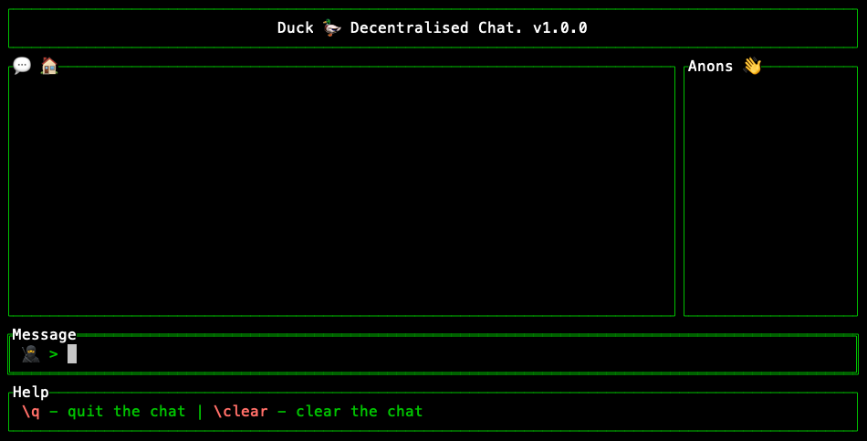

# DUCK 🦆

### _Simplifying Decentralised Communication_

If you care about data ownership and need a private free chat, Duck Chat has got your back.

_Have a private conversation in a crowded room without worrying about eavesdroppers._

## Install 🦆

### Mac

```sh
brew install dripverse/tools/duck
```

### Ubuntu/Debian based machines


```sh
sudo apt install duck
```

_Currently having some issues with installing from respective package manager repos._

### [Download Binary from latest Release](https://github.com/DripVerse/duck/releases)

## Usage:

```sh
duck
```



### Features ✨
- Complete Data Ownership
- Enhanced Privacy
- No single point of control
- No third party involvement
- Free Usage
- Open Source
- Lightweight

### Development 💻

`go install` && `go run main.go`

`make build` && `./duck`

`make install` && `duck`

## Overview

Inspired by Peerchat on Kademlia DHT which is a terminal-based P2P chat application using libp2p and the IPFS network for peer discovery and routing.
It uses a Kademlia DHT from libp2p for peer discovery and routing and supports a more fully featured host. The other components of the libp2p such as TLS encryption, peer active discovery, YAMUX stream multiplexing are integrated as well.

## Roadmap 🚀

- [x] P2P CLI Chat.
- [ ] Web link to install, setup and open chat.
- [ ] Wallet/Account Support.
- [ ] Add as Utility to DripVerse.
- [ ] ...

_[Have a request for features or add-ons?](https://github.com/DripVerse/duck/issues)_

### Devices Tested:

| Device Type | OS | Status |
| --- | --- | --- |
| Desktop | Mac Os 14 Sonoma | ✅ |
| Desktop | Linux PopOS | ✅ |

_Desktop here is used as a synonymous term for laptops, desktops, Macs and PCs._
